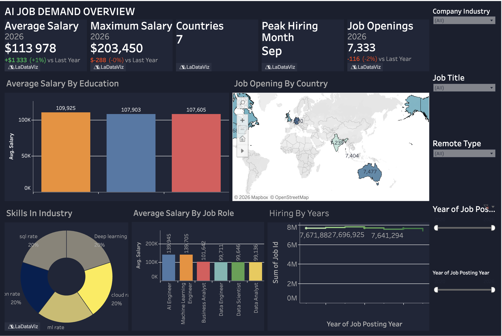

# AI Job Market Demand Dashboard 2020— 2026

An end-to-end data analytics project exploring the global AI job landscape, salary trends, and hiring patterns using Tableau.

## Project Overview
The AI industry is growing at an unprecedented pace — but where are the jobs? Who earns the most? What skills are employers demanding? This project answers those questions through an interactive Tableau dashboard built on real-world AI job posting data .
As a data analyst, I designed this dashboard to tell a clear, actionable story about the AI job market — helping job seekers, hiring managers, and researchers make informed decisions.

## 🗺️ Dashboard Story
1. KPI Summary 
What it shows: Five headline numbers that give an instant pulse of the AI job market in 2026 that is compaired with the previous year.
The story: Average salaries rose modestly (+1%) while total job openings declined slightly (-2%), suggesting the market is maturing — fewer but higher-quality roles are emerging. The $203K ceiling shows elite AI roles remain extremely lucrative.

2. Average Salary by Education 
> What it shows: Salary comparison across education levels — Bachelor's (~$109K), Master's (~$107K), and PhD (~$107K).
> The story: Surprisingly, education level has minimal impact on AI salaries — the gap between Bachelor's and PhD holders is under $3,000. This signals that skills and experience outweigh formal credentials in the AI industry, a notable finding for career planners.

- Analyst Insight: This pattern aligns with the broader tech industry trend where portfolio, GitHub contributions, and certifications often matter more than degree level.

3. Job Openings by Country 
> What it shows: Geographic distribution of AI job postings across 7 countries.
> The story: The map reveals geographic concentration of AI hiring — with visible hotspots in North America (~7,404 postings), Australia (~7,477), and parts of Europe/Asia (~7,239). The data spans only 7 countries, pointing to where AI talent demand is most formalized and structured.

- Analyst Insight: The near-equal distribution across regions suggests multinational companies are deliberately distributing AI roles globally, not just concentrating them in Silicon Valley.

4. Skills in Industry 
> What it shows: The top technical skills demanded by AI employers, broken into equal 20% slices: SQL, Deep Learning, Cloud, ML, and one additional competency.
> The story: No single skill dominates — employers want T-shaped professionals fluent in the full AI stack: data querying (SQL), model building (Deep Learning, ML), and infrastructure (Cloud). This equal distribution is a hiring signal for upskilling strategies.

- Analyst Insight: Job seekers should prioritize all five competencies rather than over-indexing on one. A candidate who can write SQL AND deploy models on AWS is significantly more competitive.

5. Average Salary by Job Role
> What it shows: Salary ranking across six AI roles: AI Engineer (~$139K), ML Engineer (~$139K), Business Analyst (~$101K), Data Engineer (~$99K), Data Scientist (~$99K), Data Analyst (~$99K).
> The story: A clear salary tier emerges — engineering roles (AI/ML Engineer) earn ~40% more than analyst roles. Despite the hype around Data Science, Data Scientists and Data Analysts earn roughly the same as Data Engineers in 2026, indicating market saturation in those roles.

- Analyst Insight: If salary maximization is the goal, pivoting from Data Scientist to ML/AI Engineer is the highest-ROI career move in the current market.

6. Hiring by Years 
> What it shows: Cumulative job ID trends over the job posting years, showing hiring volume trajectory.
> The story: The chart shows a plateau trend between 2024–2026, with figures hovering around 7.6–7.7M cumulative job IDs. This plateau, combined with the -2% YoY decline in openings, suggests the explosive AI hiring boom of 2021–2023 has stabilized into a more measured growth phase.

- Analyst Insight: Stabilization isn't decline. Companies have absorbed initial AI talent and are now hiring more strategically — quality over quantity.

## 🔍 Key Analytical Findings

Skills matter more than degrees — salary variance by education is under 3%, but role type drives a 40% salary gap.
AI hiring is geographically diversifying — 7 countries show near-equal job distribution, not a single-country concentration.
The market is maturing, not declining — slight YoY drops in openings indicate healthy stabilization, not a bubble burst.
September is the peak hiring month — job seekers should time applications for August–September for maximum opportunity.
AI/ML Engineers command the premium — at ~$139K average, they earn significantly more than all other AI-adjacent roles.

## live dashboard 
[View Interactive Dashboard on Tableau Public](https://public.tableau.com/app/profile/nishan.rana8637/viz/ai_demand/Dashboard1?publish=yes)

## 💡 What I Would Add Next

 - Salary by Remote Type — Do remote AI jobs pay more or less than on-site?
 - Skills vs. Salary correlation — Which skill combination predicts the highest salary?
 - Company Size analysis — Do startups or enterprises pay more?
 - Gender / Diversity breakdown if data is available
 - Time-to-hire metric — How fast are AI roles being filled?
 - Forecasting model — Predict 2027 salary and demand using historical trends

## 👤 About This Project
Built as part of a data analytics project  to demonstrate end-to-end skills: data wrangling, exploratory analysis, visual storytelling, and insight communication.

